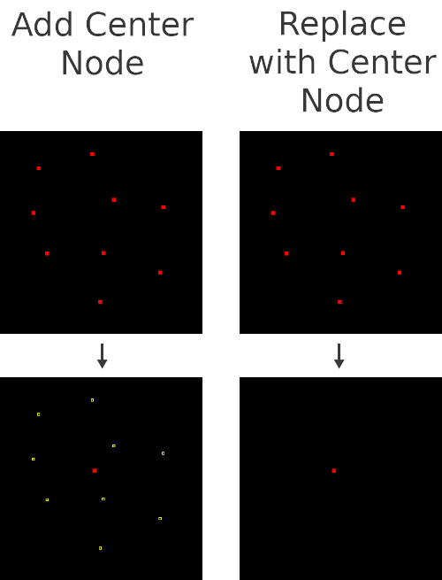

# Center Node JOSM Plugin

*Center Node* is a [JOSM](https://josm.openstreetmap.de/) plugin to create or replace the selection with the center node (at the topological average of the selection).

* [Add Center Node](USAGE.md#add-center-node)
* [Replace with Center Node](USAGE.md#replace-with-center-node)

[Usage](USAGE.md)  
[Examples](EXAMPLES.md)

## Installation

TBD

## Bugs, suggestions etc.

Create an issue on [github](https://github.com/ubipo/center-node) or contact me on [osm](https://www.openstreetmap.org/user/Ubipo).

## Contributing

Written in [Kotlin](https://kotlinlang.org/) using [Florian Schäfer's](https://gitlab.com/floscher) excellent [Gradle plugin](https://gitlab.com/floscher/gradle-josm-plugin).

Found a bug and know the cause?  
Made an improvement?  
I'm open to any pull request or suggestion.
