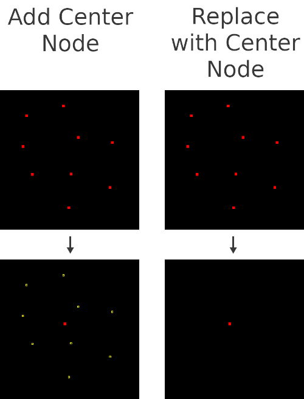

# Center Node JOSM Plugin: Usage

Also see: [examples](EXAMPLES.md)

* [Add Center Node](#add-center-node)
* [Replace with Center Node](#replace-with-center-node)



## Add Center Node

Adds a node at the center of the selection by taking the average Lat and Lon of every node.
This may not work perfectly with big scales, but it should be fine for even cities / provinces.

**Default shortcut:**  
```Alt+Shift+C```

### Usage
1. **Select elements**
2. **Active the action** by pressing the keyboard shortcut or by going to ```Menu Bar > Tools > Add Center Node```
3. **Tada!** The plugin added a new node at the topological center of your selection.


## Replace with Center Node

**Default shortcut:**  
```Ctrl+Alt+Shift+C```

### Usage
*Same as Add Center Node, only now the original selection is deleted*
